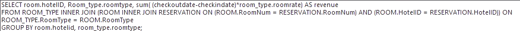
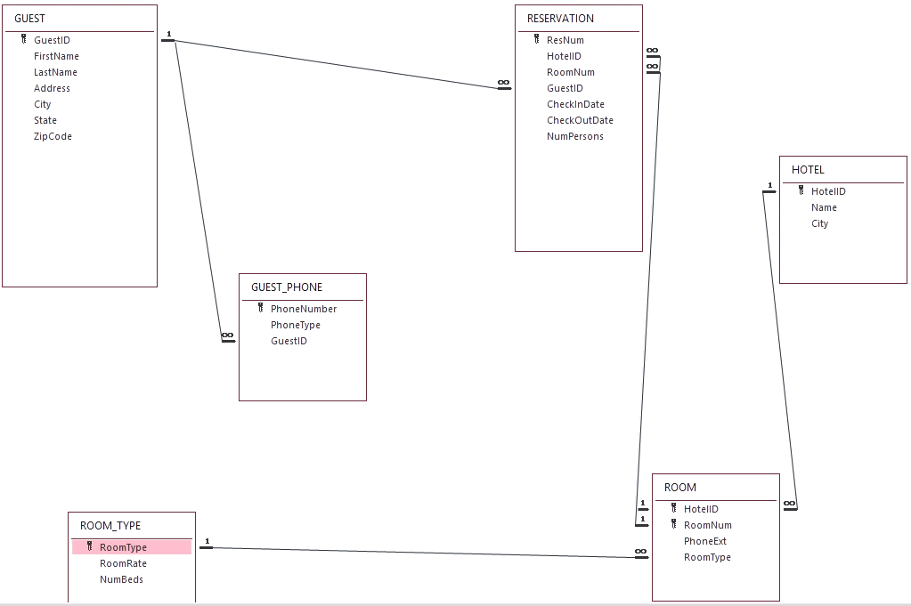
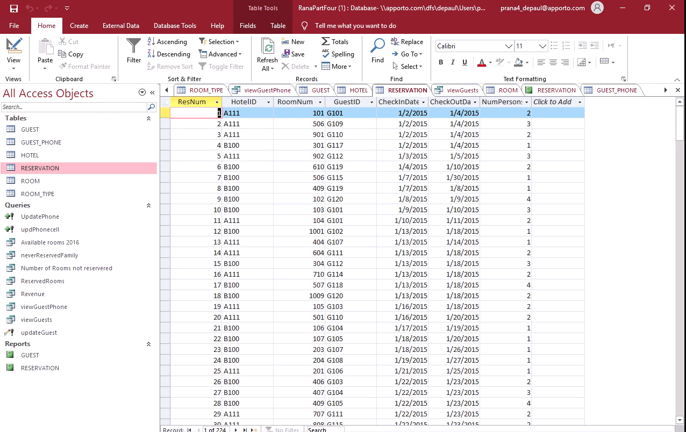

# Hotel Database Analysis Project for IT320
## In this project I created a Hotel Database

#### Summary

This assignment was for IT320 at DePaul University and taught me how to use a number of foundational SQL concepts, as outlined below:

1. Learned how to apply SQL clauses to perform the following:
* Grouping operations
* Calculations
* Aggregate functions
* Sorting techniques

2. Utilized the relational algebra concepts intrinsic in SQL for processing multiple tables using joins and or sub-queries.

3. Analyzed the requests to identify the tables, attributes, selection, and join criteria.

In completing the assignment, I used SQL queries, operations, and calculations to understand data on hotel guests, which included names, phone numbers, addresses, room reservations, and more.

Analyzing this information allowed me to identify how to forward phone calls to certain guest rooms and total company revenue based on room reservations and individual room rates. The revenue query is shown in the code sample below:

- Applied the SQL clauses to perform grouping operations, calculations and aggregate functions and sorting techniques.

#### Project Outline:
- Create subsets of table data (single table or joined tables) and apply the aggregate functions of each subset.
- Design an ERD model for a multi-location hotel booking database utilizing Lucidchart. A sample shown below.

- Join tables in a database on common (PK/FK) attributes using a inner join, left or right outer join, and a self-join.
- Create nested queries (sub-queries) for the purpose of providing values for the search criteria in the outer query.
- Implement reports to display key metrics to make informed business decisions at the hotel. 

Snapshot of the Hotel Database on Microsoft Access.

